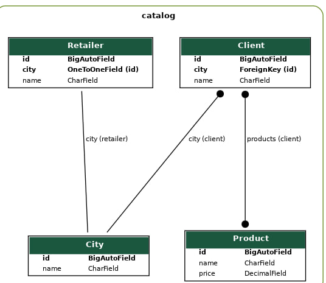

# HW6_Django
## Creating new Django project with app 'Catalog' inside

'Catalog' can include functionality for displaying a collection of items (products, books, movies, etc.) and allowing users to browse and search through those items. It might also include functionality for managing the items in the catalog, such as adding new items, editing existing items, and deleting items.

